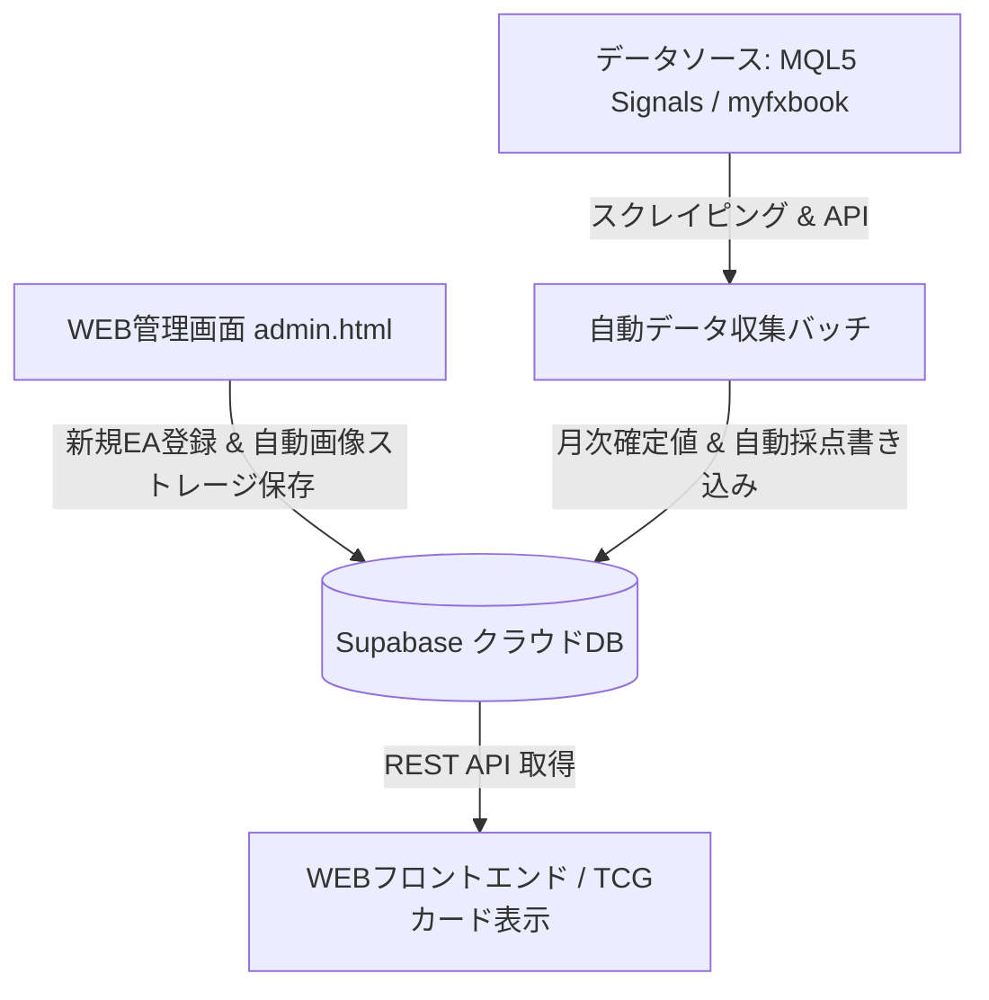

# MQL5 EA紹介・評価サイト＆データベースシステム 完全仕様書

**ドキュメントバージョン:** v4.0.0 (決定マスター版)  
**最終更新日:** 2026-09-01  
**ステータス:** 確定 (TCGデザイン ＋ 全21スキルタグ ＋ 全自動ストレージ ＋ Supabase完全連携対応)

---

## 1. システム概要と目的

本システムは、Dark Venus Lab ポータルサイトにおけるキラーコンテンツとして、各種EA（自動売買プログラム）のフォワード成績をトレーディングカード風（TCGスタイル）のリアルタイムランキングカードとして視覚化し、多角的な検索・比較・評価・マネタイズを一元管理する自動化データベースシステムである。

単なるデータ転載ではなく、MQL5等のフォワードデータに基づき独自ルールで100点満点評価＆ランク付けを行い、日本人ユーザーが直感的に比較できる統一フォーマットを提供する。

---

## 2. 全体アーキテクチャ

本システムは以下の3層構造で動作する。



1. **データ収集層**:
   * MQL5 Signals (`https://www.mql5.com/ja/signals/<ID>`) および myfxbook から月次実績・統計数値をデータパース。
2. **データベース層 (Supabase Cloud DB)**:
   * `eas` テーブル: EAマスター情報（基本スペック、21スキルタグ、6軸評価点数＆実数値、全自動保存画像URL、価格、フリー評価コメント等）。
3. **管理・表示層 (WEBフロントエンド)**:
   * `admin.html`: 全自動画像保存・21タグチェックボックス・プラットフォーム選択付き管理者ダッシュボード。
   * `card-preview.html` / `index.html`: TCGスタイルのリアルタイムEAバトルカード＆検索フィルター画面。

---

## 3. EA評価基準：6項目・100点満点

MQL5のフォワードテスト等から収集したデータに基づき、以下の基準で自動採点を行う。

| 評価項目 | 配点 | 評価の方向 | 概要 |
|---|---:|---|---|
| **月間収益率** | 20点 | 高いほど高評価 | 月当たりの平均リターン |
| **プロフィットファクター（PF）** | 20点 | 高いほど高評価 | 総利益 ÷ 総損失 |
| **リカバリーファクター（RF）** | 20点 | 高いほど高評価 | 累積純利益 ÷ 最大ドローダウン額 |
| **最大ドローダウン（DD）** | 15点 | 小さいほど高評価 | 資産の最大下落率 |
| **稼働期間** | 15点 | 長いほど高評価 | 累積の運用期間（月数・年数） |
| **収益安定性** | 10点 | 安定しているほど高評価 | 直近12か月のプラス月数割合 |
| **合計** | **100点** | | |

※推奨証拠金は採点には含めず、カードまたは詳細情報欄に実数値（例: `10万円〜`）として表示する。

### 3.1 月間収益率（20点）

| 月間収益率 | 点数 |
|---:|---:|
| 20%以上 | 20 |
| 15～19.99% | 18 |
| 10～14.99% | 16 |
| 7～9.99% | 14 |
| 5～6.99% | 12 |
| 3～4.99% | 9 |
| 1～2.99% | 5 |
| 0～0.99% | 2 |
| 0%未満 | 0 |

### 3.2 プロフィットファクター（PF：20点）

| PF | 点数 |
|---:|---:|
| 2.00以上 | 20 |
| 1.80～1.99 | 18 |
| 1.60～1.79 | 16 |
| 1.50～1.59 | 14 |
| 1.40～1.49 | 12 |
| 1.30～1.39 | 9 |
| 1.20～1.29 | 6 |
| 1.10～1.19 | 3 |
| 1.10未満 | 0 |

### 3.3 リカバリーファクター（RF：20点）

| RF | 点数 |
|---:|---:|
| 10.00以上 | 20 |
| 7.00～9.99 | 18 |
| 5.00～6.99 | 16 |
| 4.00～4.99 | 14 |
| 3.00～3.99 | 12 |
| 2.00～2.99 | 9 |
| 1.50～1.99 | 6 |
| 1.00～1.49 | 3 |
| 1.00未満 | 0 |

### 3.4 最大ドローダウン（DD：15点）

| 最大DD | 点数 |
|---:|---:|
| 5%未満 | 15 |
| 5～9.99% | 14 |
| 10～14.99% | 12 |
| 15～19.99% | 10 |
| 20～29.99% | 7 |
| 30～39.99% | 4 |
| 40～49.99% | 2 |
| 50%以上 | 0 |

### 3.5 稼働期間（15点）

| 稼働期間 | 点数 |
|---:|---:|
| 5年以上 | 15 |
| 4年以上5年未満 | 14 |
| 3年以上4年未満 | 13 |
| 2年以上3年未満 | 11 |
| 1年以上2年未満 | 8 |
| 6か月以上1年未満 | 5 |
| 3か月以上6か月未満 | 2 |
| 3か月未満 | 0 |

### 3.6 収益安定性（10点）

| 直近12か月のプラス月数 | 点数 |
|---:|---:|
| 12か月 | 10 |
| 11か月 | 9 |
| 10か月 | 8 |
| 9か月 | 7 |
| 8か月 | 6 |
| 7か月 | 5 |
| 6か月 | 4 |
| 5か月 | 3 |
| 4か月 | 2 |
| 3か月 | 1 |
| 0～2か月 | 0 |

---

## 4. 総合ランク判定

6項目の合計点（100点満点）に基づき、以下の総合ランクを付与する。

| 総合ポイント | ランク | ランクバッジ素材 |
|---:|:---:|:---:|
| 90～100 | **SSS** | `rank_SS.png` (カスタム装飾) |
| 80～89 | **SS** | `rank_SS.png` |
| 70～79 | **S** | サイト独自デザイン |
| 60～69 | **A** | サイト独自デザイン |
| 50～59 | **B** | サイト独自デザイン |
| 40～49 | **C** | サイト独自デザイン |
| 0～39 | **D** | サイト独自デザイン |

---

## 5. スキルタグ分類（全21項目）

EAのロジック・スタイルを以下の3カテゴリー（計21種類）に分類して管理・検索可能とする。

### 5.1 戦略 (8種)
* `トレンドフォロー`: トレンド方向への順張り
* `逆張り・平均回帰`: 行き過ぎからの反転を狙う
* `ブレイクアウト`: 高値・安値などの突破を狙う
* `モメンタム`: 値動きの勢いを利用
* `レンジ`: 一定範囲内の値動きを利用
* `ニュース`: 経済指標・ニュース発表を利用
* `アービトラージ`: 価格差・時間差などを利用
* `マルチ戦略`: 複数の戦略を組み合わせる

### 5.2 取引スタイル (5種)
* `スキャルピング`: 短時間で売買を完結
* `デイトレード`: 基本的に日をまたがず取引
* `スイング`: 数日～数週間程度保有
* `ポジショントレード`: 数週間～数か月程度保有
* `マルチタイムフレーム`: 複数時間足を利用

### 5.3 ポジション管理 (8種)
* `単発エントリー`: 基本的に追加せず完結
* `複数ポジション`: 複数ポジションを保有
* `グリッド`: 一定の価格間隔などで複数注文を配置
* `ナンピン`: 価格が逆行した際に追加して平均取得価格を調整
* `マーチンゲール`: 損失後などにロットを増加させる
* `ピラミッディング`: 利益方向への値動きに合わせて追加
* `ヘッジ`: 反対方向のポジション等でリスクを調整
* `トレーリング`: 利益に応じてSL等を追従させる

※カードのスキル枠表示ルール: 登録されたタグのうち上位最大4〜5個を2行以内で表示する。

---

## 6. EAデータベース ＆ 登録ツール（`admin.html`）仕様

管理者がWeb上から短時間でEAマスター情報を登録・更新できるシステムの完全仕様。

### 6.1 登録項目一覧

1. **基本スペック**:
   * EA名 (`name`)
   * 識別キー (`ea_key`)
   * 対応プラットフォーム (`platform`: `MT4`, `MT5` のチェックボックス選択)
   * 通貨ペア (`currency_pair`) / 時間足 (`timeframe`) / ブローカー (`broker`)
2. **URL ＆ メディア**:
   * 商品・紹介ページURL (`product_url`): MQL5等の購入・入手先
   * フォワードテストURL (`forward_url`): myfxbook / MQL5 Signal
   * EAサムネイル画像 (`image_url`): **URL貼付時に裏側で全自動取得 ➔ Supabase Storageへ保存＆永続化（1秒完了）**
3. **スキルタグ**:
   * 上記全21項目のチェックボックスから任意選択（配列 `tags` として保持）
4. **6軸評価数値 ＆ スコア**:
   * 各項目の点数（0〜20点/15点/10点）および実数値（例: `+16.4%`, `1.4` 等）
   * TotalScore (0〜100) および総合ランク (SSS〜D)
   * 推奨証拠金 (`recommended_margin`)
5. **価格 ＆ 公開ステータス**:
   * 表示価格テキスト (`price_text`) / 数値価格 (`price_value`)
   * 公開フラグ (`is_active`: 公開 / 下書き)
6. **フリーテキスト解説**:
   * 管理人評価コメント (`description`): 特徴・レビュー文（複数行）
   * 運用注意事項・メモ (`notes`): 指標停止や推奨設定などの注意事項（複数行）

---

## 7. データベース DDL スキーマ定義 (Supabase PostgreSQL)

```sql
CREATE TABLE eas (
    id SERIAL PRIMARY KEY,
    ea_key VARCHAR(50) UNIQUE NOT NULL,
    name VARCHAR(100) NOT NULL,
    platform TEXT[] DEFAULT '{"MT4"}',            -- 'MT4', 'MT5' の配列
    currency_pair VARCHAR(20) NOT NULL,
    timeframe VARCHAR(10) NOT NULL,
    broker VARCHAR(50),
    
    -- URL & 画像
    product_url TEXT NOT NULL,                    -- EA商品・紹介ページURL
    forward_url TEXT,                             -- フォワード実績ページURL
    image_url TEXT,                               -- 自動保存済みサムネイル画像URL
    
    -- スキルタグ (21項目対応)
    tags TEXT[] DEFAULT '{}',                     -- チェックされたタグ名の配列
    
    -- 6項目評価点数 & 実数値
    total_score INT DEFAULT 0,
    rank_badge VARCHAR(10) DEFAULT 'S',
    score_monthly_return INT DEFAULT 0,
    raw_monthly_return VARCHAR(20),
    score_pf INT DEFAULT 0,
    raw_pf VARCHAR(20),
    score_rf INT DEFAULT 0,
    raw_rf VARCHAR(20),
    score_dd INT DEFAULT 0,
    raw_dd VARCHAR(20),
    score_period INT DEFAULT 0,
    raw_period VARCHAR(20),
    score_stability INT DEFAULT 0,
    raw_stability VARCHAR(20),
    recommended_margin VARCHAR(50),
    
    -- 価格 & ステータス
    price_text VARCHAR(50) DEFAULT '無料 (オープンソース)',
    price_value NUMERIC(10, 2) DEFAULT 0.00,
    is_active BOOLEAN DEFAULT true,
    
    -- フリーテキスト
    description TEXT,                             -- 管理人レビュー文
    notes TEXT,                                   -- 注意事項メモ
    
    created_at TIMESTAMP WITH TIME ZONE DEFAULT CURRENT_TIMESTAMP,
    updated_at TIMESTAMP WITH TIME ZONE DEFAULT CURRENT_TIMESTAMP
);
```

---

## 8. 改訂履歴 (Version History)

* **v1.0.0 (2026-08-01)**: 初版設計。
* **v2.0.0 (2026-08-02)**: Supabase移行および管理画面 `admin.html` 基本設計。
* **v3.0.0 (2026-08-23)**: MQL5 Signalsデータ連携および採点モデルの統一。
* **v4.0.0 (2026-09-01) [確定版]**:
  * TCG物理カードスタイルのビジュアルデザイン確定。
  * スキルタグ全21項目の選定および配列型（`tags TEXT[]`）の一本化決定。
  * 画像の全自動キャプチャ＆Supabase Storage永続保存仕様の確立。
  * 商品ページURLとフォワードURLの分離、MT4/MT5複数選択、フリー評価文・注意事項カラムを正式追加。
  * 旧 `ea_battle_system_specification.md` の全情報を統合し、唯一のマスター仕様書として一本化。
