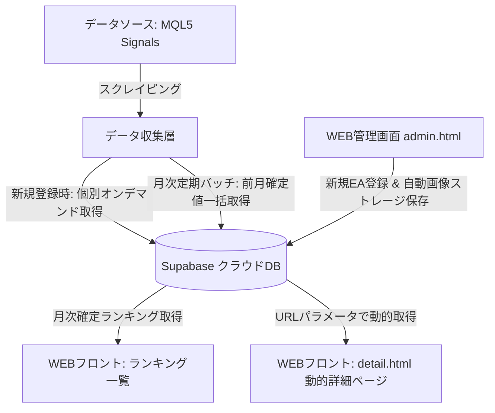

# MQL5 EA紹介・評価サイト＆データベースシステム 完全仕様書

**ドキュメントバージョン:** v5.2.0 (最新マスター版)  
**最終更新日:** 2026-09-13  
**ステータス:** 確定 (7セクション管理画面レイアウト確定 ＋ 必須入力バリデーション ＋ 通貨/価格自動生成 ＋ 確定順位ロック運用)

---

## 1. システム概要と目的

本システムは、Dark Venus Lab ポータルサイトにおけるキラーコンテンツとして、各種EA（自動売買プログラム）のフォワード成績をトレーディングカード風（TCGスタイル）の確定ランキングカードとして視覚化し、多角的な検索・比較・評価・マネタイズを一元管理する自動化データベースシステムである。

単なるデータ転載ではなく、MQL5等のフォワードデータに基づき独自ルールで100点満点評価＆ランク付けを行い、日本人ユーザーが直感的に比較できる統一フォーマットを提供する。

---

## 2. 全体アーキテクチャ ＆ 運用方針

本システムは以下の3層構造および運用方針で動作する。



### 運用基本方針
1. **月次確定ランキング（過去スナップショット固定 ＆ 確定順位ヘッダー）**:
   * 月の途中でのリアルタイムランキング変動は行わず、**前月確定分の実績に基づく「月次確定ランキング」** を公開する。
   * 一度確定・公開した過去月のランキングはアーカイブとして固定し、後から新EAが追加されても過去ランキング順位は書き換えない（サイトの公平性と透明性の保持）。
   * EAごとに **「ランキング参加開始月 (`published_from`)」** を明示し、「なぜ過去のランキングに載っていないのか」という読者の疑問を解消する。
   * **確定順位 (`rank_position`) の確定・更新タイミング**:
     * 個別スクレイピング実行時には `rank_position` をリアルタイム更新しない（順位変動の混乱や不整合を防ぐため、初期値は空/NULLとする）。
     * 毎月初旬、対象月（例: 2026-01）の全EA実績データが出揃った段階で、管理画面の「月次ランキング確定」処理（または月次バッチ）を実行。
     * システムが全EAのスコア・月利等を一括比較・ソートし、`ea_monthly_summaries` テーブルの `rank_position`（1位、2位、3位…）を一斉に書き込んでロック（確定）する。

2. **過去ランキング画面の表示構成（カード ＋ テーブルのハイブリッド方式）**:
   * 過去ランキングページにおいて、**上位5位までは「動的EAカード」を表示**し、豪華で目を引くビジュアルを維持する。
   * **6位以降は一覧テーブル形式**でコンパクトかつスピーディに成績を閲覧できるようにし、ページ全体の読み込み負荷と一覧性を両立する。
   * 動的レンダリング（データスナップショット × 最新カードコンポーネント）を採用するため、将来カードUIデザインが改善された場合でも、過去ランキングの順位・数値を維持したまま最新の美しいデザインで閲覧できる。

3. **スクレイピング収集サイクル ＆ 2段階安全フロー**:
   * **管理画面からの個別スクレイピング（新規登録・オンデマンド更新）**:
     * 抽出期間パラメータ：「いつから（初期値: `2025-01`）」〜「いつまで（初期値: `当月`、上限: `2035-12`）」を柔軟に指定可能。
     * ※2026年1月のランキング公開開始時点で、過去12か月前（2025年1月〜）の月別リターン推移が存在することで、6軸評価の「収益安定性（直近12か月のプラス月割合）」を公平かつ正確に採点できる。
     * **「確認 ➔ DB登録」の2段階セーフティフロー**:
       * スクレイピング実行直後にDBへ直接書き込まず、管理画面の各入力欄へ一度自動展開する。
       * 管理人が目視で数値の妥当性を確認・微調整した上で【データベースへ保存】ボタンを押すことで、イレギュラー値によるDB破壊を完全に防ぐ。
   * **月次定期バッチ**: 毎月初旬に、登録済み全EAの「前月確定データ」のみを安全・軽量に自動巡回取得。

4. **詳細ページの動的生成（SPA / パラメータ方式）**:
   * 静的HTMLを量産せず、単一のテンプレートファイル（`detail.html?id=xxx`）を用意。
   * URLパラメータに応じてSupabaseからデータを動的取得・レンダリングするため、EAが増えてもファイル管理の手間が一切増えない。

5. **メモ欄の完全一本化 ＆ コピペ抽出の廃止**:
   * 旧仕様の「管理人評価コメント (`description`)」と「運用注意事項 (`notes`)」を統合し、**統合メモ欄 (`notes`) 1本に集約**。推奨ブローカー、特定口座限定、指標停止推奨、EAの特徴レビューを自由形式でまとめて管理する（箇条書き・改行対応）。
   * 月次確定実績テーブルまで網羅する個別スクレイピング方針への一本化に伴い、簡易テキストコピペ抽出機能は廃止（画面から完全撤廃）。

6. **管理画面（`tools/dv-master-console-9f82.html`）の7セクション標準レイアウト ＆ 必須バリデーション**:
   * 入力ミスの防止・視認性・運用効率を高めるため、登録フォームを以下の論理的な7セクション順に固定化する。
     1. **1. 基本スペック**: EA名(\*)、EA識別キー(\*)、プラットフォーム(\*)、通貨ペア(\*)、時間足(\*)、稼働ブローカー、21スキルタグ
     2. **2. URL ＆ 画像メディア**: 商品ページURL(\*)、EAサムネイル画像URL(\*) ＋ [Storageへ自動永続保存]ボタン ※フォワードURLはスクレイピング側へ一本化
     3. **3. MQL5個別スクレイピング連携**: MQL5シグナルURL(\*)、取得開始年月(\*)、取得終了年月(\* 初期値: 前月)、[MQL5データ取得]ボタン
     4. **4. 詳細ページ用フォワード実績 ＆ 月次確定推移プレビュー**: スクレイピング取得データの目視確認用プレビュー（6軸生数値 ＋ 13詳細実績 ＋ 月別推移テーブル）
     5. **5. EAランク**: 対象年月 (カード印字用: \*)、TotalScore (0〜100点: 自動算出)、総合ランク (自動判定 SSS〜D)
     6. **6. 価格 ＆ 公開設定**: 通貨(\* USD/JPY/EUR)、価格数値(\* 半角数字, 0=無料)、表示価格テキスト（自動生成・手動微調整可）、推奨証拠金、公開ステータス
     7. **7. 統合管理メモ ＆ 運用注意事項**: 改行・箇条書きに対応したフリーテキストエリア
   * **価格・通貨の自動生成仕様**:
     * 価格数値が `0` の場合は、通貨に関わらず表示テキストを自動的に「`無料`」とする。
     * 価格数値が `1` 以上の場合は、選択された通貨記号を付与して自動生成（例: USD 99 ➔ `$99`、JPY 10000 ➔ `¥10,000`、EUR 150 ➔ `€150`）。
     * 自動生成された表示テキストは入力欄に自動反映され、必要に応じて管理人が手動編集することも可能。

---

## 3. EA評価基準：6項目・100点満点（S項目 / カード評価軸）

MQL5のフォワードテスト等から収集したデータに基づき、以下の基準で自動採点を行う。

| 評価項目 | 配点 | 評価の方向 | 概要・算出根拠 |
|---|---:|---|---|
| **月間収益率** | 20点 | 高いほど高評価 | 直近確定月の収益率（%） |
| **プロフィットファクター（PF）** | 20点 | 高いほど高評価 | 総利益 ÷ 総損失 |
| **リカバリーファクター（RF）** | 20点 | 高いほど高評価 | 累積純利益 ÷ 最大ドローダウン額 |
| **最大ドローダウン（DD）** | 15点 | 小さいほど高評価 | エクイティ基準の資産最大下落率（%） |
| **稼働期間** | 15点 | 長いほど高評価 | 累積の運用期間（週数・月数・年数） |
| **収益安定性** | 10点 | 安定しているほど高評価 | **直近12か月の月別リターン表でプラスだった月数割合** |
| **合計** | **100点** | | 総合スコアおよび総合ランク（SSS〜D）を算出 |

※推奨証拠金は採点には含めず、カードまたは詳細情報欄に実数値（例: `10万円〜`）として表示する。

### 3.1 月間収益率（20点）
| 月間収益率 | 点数 |
|---:|---:|
| 20%以上 | 20 |
| 15～19.99% | 18 |
| 10～14.99% | 16 |
| 7～9.99% | 14 |
| 5～6.99% | 12 |
| 3～4.99% | 9 |
| 1～2.99% | 5 |
| 0～0.99% | 2 |
| 0%未満 | 0 |

### 3.2 プロフィットファクター（PF：20点）
| PF | 点数 |
|---:|---:|
| 2.00以上 | 20 |
| 1.80～1.99 | 18 |
| 1.60～1.79 | 16 |
| 1.50～1.59 | 14 |
| 1.40～1.49 | 12 |
| 1.30～1.39 | 9 |
| 1.20～1.29 | 6 |
| 1.10～1.19 | 3 |
| 1.10未満 | 0 |

### 3.3 リカバリーファクター（RF：20点）
| RF | 点数 |
|---:|---:|
| 10.00以上 | 20 |
| 7.00～9.99 | 18 |
| 5.00～6.99 | 16 |
| 4.00～4.99 | 14 |
| 3.00～3.99 | 12 |
| 2.00～2.99 | 9 |
| 1.50～1.99 | 6 |
| 1.00～1.49 | 3 |
| 1.00未満 | 0 |

### 3.4 最大ドローダウン（DD：15点）
| 最大DD | 点数 |
|---:|---:|
| 5%未満 | 15 |
| 5～9.99% | 14 |
| 10～14.99% | 12 |
| 15～19.99% | 10 |
| 20～29.99% | 7 |
| 30～39.99% | 4 |
| 40～49.99% | 2 |
| 50%以上 | 0 |

### 3.5 稼働期間（15点）
| 稼働期間 | 点数 |
|---:|---:|
| 5年以上 | 15 |
| 4年以上5年未満 | 14 |
| 3年以上4年未満 | 13 |
| 2年以上3年未満 | 11 |
| 1年以上2年未満 | 8 |
| 6か月以上1年未満 | 5 |
| 3か月以上6か月未満 | 2 |
| 3か月未満 | 0 |

### 3.6 収益安定性（10点）
| 直近12か月のプラス月数 | 点数 |
|---:|---:|
| 12か月 | 10 |
| 11か月 | 9 |
| 10か月 | 8 |
| 9か月 | 7 |
| 8か月 | 6 |
| 7か月 | 5 |
| 6か月 | 4 |
| 5か月 | 3 |
| 4か月 | 2 |
| 3か月 | 1 |
| 0～2か月 | 0 |

---

## 4. 総合ランク判定

6項目の合計点（100点満点）に基づき、以下の総合ランクを付与する。

| 総合ポイント | ランク | ランクバッジ |
|---:|:---:|:---:|
| 90～100 | **SSS** | `rank_SS.png` (カスタム装飾) |
| 80～89 | **SS** | `rank_SS.png` |
| 70～79 | **S** | サイト独自デザイン |
| 60～69 | **A** | サイト独自デザイン |
| 50～59 | **B** | サイト独自デザイン |
| 40～49 | **C** | サイト独自デザイン |
| 0～39 | **D** | サイト独自デザイン |

---

## 5. 【完全版】EA表示項目 × データ取得元 マトリックス表 (7セクション完全連動)

画面上の配置（「カード」または「詳細ページ」）と、データの取得方法（「スクレイピング」または「マスタ手動」）、および管理画面の7セクションに完全連動した対応マトリクス。  
※項目名に **(\*)** が付いているものは登録時の**入力必須項目**。

| セクション | # | 項目名 | 画面配置 | 取得・生成方法 | MQL5スクレイピング元 / 入力内容 | Supabaseカラム名 |
|:---|:---:|:---|:---:|:---:|:---|:---|
| **1. 基本スペック** | 1 | **EA名 (\*)** | カード ＆ 詳細 | マスタ手動 | シグナルヘッダー `h1` または 手動入力 | `name` |
| | 2 | **EA識別キー (\*)** | 管理キー | マスタ手動 | 一意のシステムID（半角英数記号） | `ea_key` |
| | 3 | **プラットフォーム (\*)** | カード ＆ 詳細 | マスタ手動 | `MT4`, `MT5` のチェック選択 | `platform` |
| | 4 | **通貨ペア (\*)** | カード ＆ 詳細 | マスタ手動 | 例: `EURUSD`, `USDJPY` | `currency_pair` |
| | 5 | **時間足 (\*)** | カード ＆ 詳細 | マスタ手動 | 例: `M5`, `H1` | `timeframe` |
| | 6 | **稼働ブローカー** | 詳細のみ | マスタ手動 | フォワード稼働ブローカー（例: IC Markets） | `broker` |
| | 7 | **21スキルタグ** | カード ＆ 詳細 | マスタ手動 | スキャル、ナンピン、損切りあり等のタグ配列 | `tags` |
| **2. URL ＆ 画像** | 8 | **商品ページURL (\*)** | 詳細のみ | マスタ手動 | MQL5製品ページや公式サイトURL | `product_url` |
| | 9 | **EAサムネイル画像 (\*)** | カード ＆ 詳細 | 手動 / Storage | URL貼付時にStorage自動永続保存 | `image_url` |
| **3. MQL5連携** | 10 | **MQL5シグナルURL (\*)** | 詳細ボタン | マスタ手動 | MQL5シグナルページのURL | `forward_url` |
| | - | *取得開始年月 (\*)* | 連携パラメータ | フォーム指定 | 初期値 `2025-01`（スクレイピング抽出用） | - |
| | - | *取得終了年月 (\*)* | 連携パラメータ | フォーム指定 | 初期値 `前月`（スクレイピング抽出用） | - |
| **4. 実績 ＆ 月次推移** | 11 | **月間収益率 (生数値)** | カード ＆ 詳細 | **スクレイピング** | 直近確定月の月利（%） | `raw_monthly_return` |
| | 12 | **プロフィットファクター (PF)** | カード ＆ 詳細 | **スクレイピング** | `プロフィットファクター:` の数値 | `raw_pf` |
| | 13 | **リカバリーファクター (RF)** | カード ＆ 詳細 | **スクレイピング** | `リカバリーファクター:` の数値 | `raw_rf` |
| | 14 | **最大ドローダウン (DD%)** | カード ＆ 詳細 | **スクレイピング** | `最大ドローダウン:` （エクイティ基準%） | `raw_dd` |
| | 15 | **稼働期間 (生数値)** | カード ＆ 詳細 | **スクレイピング** | `週: XX週間` または 開始日からの経過月数 | `raw_period` |
| | 16 | **収益安定性 (生数値)** | カード ＆ 詳細 | **自動算出（月別表）** | 直近12か月の月別リターン表でプラスだった月数 | `raw_stability` |
| | 17 | **全期間純利益額** | 詳細のみ | **スクレイピング** | `利益:` の金額＋通貨単位 | `total_profit` |
| | 18 | **現在残高** | 詳細のみ | **スクレイピング** | `残高:` の金額＋通貨単位（※エクイティは割愛） | `balance` |
| | 19 | **総入金額** | 詳細のみ | **スクレイピング合算** | `最初の入金` ＋ `入金` の合算値 | `total_deposits` |
| | 20 | **出金総額** | 詳細のみ | **スクレイピング** | `出金:` の金額＋通貨単位 | `total_withdrawals` |
| | 21 | **勝率 ＆ 勝ちトレード数** | 詳細のみ | **スクレイピング** | `利益トレード:` の件数と勝率% | `raw_win_rate`, `win_trades` |
| | 22 | **総取引数 ＆ 負けトレード数**| 詳細のみ | **スクレイピング** | `トレード:` の総数、`損失トレード:` の件数 | `raw_trade_count`, `loss_trades` |
| | 23 | **ベストトレード** | 詳細のみ | **スクレイピング** | `ベストトレード:` の金額 | `best_trade` |
| | 24 | **最悪のトレード** | 詳細のみ | **スクレイピング** | `最悪のトレード:` の金額（最大損失額） | `worst_trade` |
| | 25 | **期待されたペイオフ** | 詳細のみ | **スクレイピング** | `期待されたペイオフ:` の金額（期待利得） | `expected_payoff` |
| | 26 | **最大証拠金使用率** | 詳細のみ | **スクレイピング** | `最大入金額:` の%（Max Deposit Load） | `max_deposit_load` |
| | 27 | **取引アクティビティ** | 詳細のみ | **スクレイピング** | `取引アクティビティ:` の% | `trading_activity` |
| | 28 | **1週間あたりの取引数** | 詳細のみ | **スクレイピング** | `1週間当たりの取引:` の数値 | `trades_per_week` |
| | 29 | **平均保有時間** | 詳細のみ | **スクレイピング** | `平均保有時間:` の文字列（例: 15時間） | `avg_holding_time` |
| | 30 | **シャープレシオ** | 詳細のみ | **スクレイピング** | `シャープレシオ:` の数値 | `sharpe_ratio` |
| | 31 | **月別リターン履歴** | 詳細のみ | **スクレイピング（表）** | 年月ごとの成長率（%）一覧マトリクス | `ea_monthly_summaries` テーブル |
| **5. EAランク** | 32 | **対象年月 (\*)** | カード印字 | マスタ手動 | カード印字・表示基準年月（例: `2026.08`） | `target_month` |
| | 33 | **ランキング参加開始月** | カード ＆ 詳細 | マスタ手動 | 追跡開始月（例: `2026-08`） | `published_from` |
| | 34 | **確定順位** | カード ＆ 詳細 | **月次確定バッチ** | 対象月の確定順位（1位、2位…） | `current_rank` / `rank_position` |
| | 35 | **総合スコア ＆ 総合ランク** | カード ＆ 詳細 | **システム自動算出** | 6軸合計点 (0〜100) ＆ ランク (SSS〜D) | `total_score`, `rank_badge` |
| | 36 | **6軸評価配点スコア** | 詳細（6軸表） | **システム自動算出** | 各軸の配点点数（月利20/PF20/RF20/DD15/期間15/安定10） | `score_xxx` 各種カラム |
| **6. 価格 ＆ 公開設定**| 37 | **通貨 (\*)** | 管理・自動生成 | マスタ手動 | `USD`, `JPY`, `EUR` 等の選択 | `price_currency` |
| | 38 | **価格数値 (\*)** | 管理・自動生成 | マスタ手動 | 半角数字（`0` は無料を意味する） | `price_value` |
| | 39 | **表示価格テキスト** | カード ＆ 詳細 | **自動生成 (微調整可)** | 例: `無料`, `$99`, `¥10,000`, `€150` | `price_text` |
| | 40 | **コピートレード価格数値** | 管理・自動生成 | マスタ手動 (任意) | 半角数字（例: `30`。空欄または0=無料） | `copy_price_value` |
| | 41 | **コピートレード表示テキスト** | カード ＆ 詳細 | **自動生成 (微調整可)** | 例: `$30 / 月`, `無料` | `copy_price_text` |
| | 42 | **推奨証拠金** | カード ＆ 詳細 | マスタ手動 | 例: `10万円〜`, `$1,000〜` | `recommended_margin` |
| | 43 | **公開ステータス** | 公開制御 | マスタ手動 | 公開 (true) / 非公開 (false) | `is_active` |
| **7. 統合管理メモ** | 44 | **統合管理メモ・注意事項** | 詳細のみ | マスタ手動 (任意) | 推奨口座・指標停止・特徴レビュー（改行・箇条書き対応） | `notes` |

---

## 6. 詳細ページ（`detail.html?id=xxx`）レイアウト構成

1枚の動的テンプレートHTMLにより、URLパラメータに基づいて以下の縦フローでレンダリングする。

1. **ヘッダー・パンくずリスト**: TOP > ランキング > EA名
2. **【最上段】EAカード（メインアイキャッチ）**:
   * TCGスタイルのカード表示（総合ランク、バッジ、6軸スコア、主要タグ、推奨証拠金、公式リンクボタン）。
3. **【中段】カード項目のテーブル（6軸評価詳細）**:
   * 月間収益率、PF、RF、最大DD、稼働期間、収益安定性のスコア配点と生数値を整理した比較表。
4. **【下段】それ以外の項目テーブル（詳細実績＆取引スペック）**:
   * 通貨ペア、時間足、価格、稼働ブローカー、純利益、残高、総入金額、出金総額、勝率、取引数、ベスト/最悪トレード、期待ペイオフ、最大証拠金使用率、取引アクティビティ、管理メモ・注意事項。
5. **【最下段】月次実績推移＆過去順位バックナンバーテーブル**:
   * 年月ごとの「月間収益率（%）」および確定ランキングの「過去順位（◯位）」の全履歴一覧。

---

## 7. スキルタグ分類（全21項目）

EAのロジック・スタイルを以下の3カテゴリー（計21種類）に分類して管理・検索可能とする。

### 7.1 戦略 (8種)
* `トレンドフォロー`: トレンド方向への順張り
* `逆張り・平均回帰`: 行き過ぎからの反転を狙う
* `ブレイクアウト`: 高値・安値などの突破を狙う
* `モメンタム`: 値動きの勢いを利用
* `レンジ`: 一定範囲内の値動きを利用
* `ニュース`: 経済指標・ニュース発表を利用
* `アービトラージ`: 価格差・時間差などを利用
* `マルチ戦略`: 複数の戦略を組み合わせる

### 7.2 取引スタイル (5種)
* `スキャルピング`: 短時間で売買を完結
* `デイトレード`: 基本的に日をまたがず取引
* `スイング`: 数日～数週間程度保有
* `ポジショントレード`: 数週間～数か月程度保有
* `マルチタイムフレーム`: 複数時間足を利用

### 7.3 ポジション管理 (8種)
* `単発エントリー`: 基本的に追加せず完結
* `複数ポジション`: 複数ポジションを保有
* `グリッド`: 一定の価格間隔などで複数注文を配置
* `ナンピン`: 価格が逆行した際に追加して平均取得価格を調整
* `マーチンゲール`: 損失後などにロットを増加させる
* `ピラミッディング`: 利益方向への値動きに合わせて追加
* `ヘッジ`: 反対方向のポジション等でリスクを調整
* `トレーリング`: 利益に応じてSL等を追従させる

---

## 8. データベース DDL スキーマ定義 (Supabase PostgreSQL)

```sql
-- 1. EA Master Table (7セクション完全連動マスターテーブル)
CREATE TABLE IF NOT EXISTS public.ea_master (
    id SERIAL PRIMARY KEY,
    
    -- 【1. 基本スペック】
    ea_key VARCHAR(100) NOT NULL UNIQUE,
    name VARCHAR(150) NOT NULL,
    platform text[] DEFAULT '{MT4}',
    currency_pair VARCHAR(50) DEFAULT 'EURUSD',
    timeframe VARCHAR(50) DEFAULT 'H1',
    broker VARCHAR(100) DEFAULT '',
    tags text[] DEFAULT '{}',
    
    -- 【2. URL ＆ 画像メディア】
    product_url TEXT NOT NULL,                     -- 商品ページURL (*)
    image_url TEXT NOT NULL,                       -- EAサムネイル画像URL (*)
    
    -- 【3. MQL5個別スクレイピング連携】
    forward_url TEXT NOT NULL,                     -- MQL5シグナルURL (*)
    
    -- 【4. 詳細ページ用フォワード実績 ＆ 月次推移プレビュー】
    -- 6軸生数値
    raw_monthly_return VARCHAR(50) DEFAULT '0%',
    raw_pf VARCHAR(50) DEFAULT '0.0',
    raw_rf VARCHAR(50) DEFAULT '0.0',
    raw_dd VARCHAR(50) DEFAULT '0%',
    raw_period VARCHAR(50) DEFAULT '0ヶ月',
    raw_stability VARCHAR(50) DEFAULT '0ヶ月',
    -- 13詳細実績
    total_profit VARCHAR(50) DEFAULT '0.00 EUR',
    balance VARCHAR(50) DEFAULT '0.00 EUR',
    total_deposits VARCHAR(50) DEFAULT '0.00 EUR',
    total_withdrawals VARCHAR(50) DEFAULT '0.00 EUR',
    raw_win_rate VARCHAR(20) DEFAULT '0%',
    win_trades INT DEFAULT 0,
    loss_trades INT DEFAULT 0,
    raw_trade_count INT DEFAULT 0,
    best_trade VARCHAR(50) DEFAULT '0.00',
    worst_trade VARCHAR(50) DEFAULT '0.00',
    expected_payoff VARCHAR(50) DEFAULT '0.00',
    max_deposit_load VARCHAR(20) DEFAULT '0%',
    trading_activity VARCHAR(20) DEFAULT '0%',
    trades_per_week INT DEFAULT 0,
    avg_holding_time VARCHAR(50) DEFAULT '',
    sharpe_ratio VARCHAR(20) DEFAULT '0.0',
    
    -- 【5. EAランク ＆ カード印字スコア】
    target_month VARCHAR(10) DEFAULT '2026.08',    -- 対象年月（カード印字用） (*)
    published_from VARCHAR(10) DEFAULT '2026-08',  -- ランキング参加開始月
    current_rank INT,                              -- 直近確定月の確定順位
    total_score INT DEFAULT 0,                     -- 6軸合計点 (0〜100)
    rank_badge VARCHAR(10) DEFAULT 'D',            -- 総合ランク (SSS〜D)
    score_monthly_return INT DEFAULT 0,
    score_pf INT DEFAULT 0,
    score_rf INT DEFAULT 0,
    score_dd INT DEFAULT 0,
    score_period INT DEFAULT 0,
    score_stability INT DEFAULT 0,
    
    -- 【6. 価格 ＆ 公開設定】
    price_currency VARCHAR(10) DEFAULT 'USD',      -- 通貨 (USD, JPY, EUR) (*)
    price_value NUMERIC(10, 2) DEFAULT 0,          -- 価格数値 (0 = 無料) (*)
    price_text VARCHAR(100) DEFAULT '無料',        -- 表示価格テキスト (自動生成・編集可)
    copy_price_value NUMERIC(10, 2) DEFAULT NULL,   -- コピートレード価格数値 (月額, NULL/0 = 未設定または無料)
    copy_price_text VARCHAR(100) DEFAULT '',       -- コピートレード表示テキスト (例: $30 / 月)
    recommended_margin VARCHAR(100) DEFAULT '',    -- 推奨証拠金
    is_active BOOLEAN DEFAULT TRUE,                -- 公開ステータス
    
    -- 【7. 統合管理メモ ＆ 運用注意事項】
    notes TEXT DEFAULT '',                         -- 統合メモ (箇条書き・改行対応)
    
    created_at TIMESTAMP WITH TIME ZONE DEFAULT CURRENT_TIMESTAMP,
    updated_at TIMESTAMP WITH TIME ZONE DEFAULT CURRENT_TIMESTAMP
);

-- 2. Monthly Finalized Performance Summaries (月次確定実績推移)
CREATE TABLE IF NOT EXISTS public.ea_monthly_summaries (
    id BIGSERIAL PRIMARY KEY,
    ea_id INT NOT NULL REFERENCES public.ea_master(id) ON DELETE CASCADE,
    year_month VARCHAR(7) NOT NULL,                -- e.g. '2026-08'
    monthly_return_percent NUMERIC(8, 2) DEFAULT 0,
    rank_position INT,                             -- その月の確定順位
    max_drawdown_percent NUMERIC(8, 2) DEFAULT 0,
    recovery_factor NUMERIC(8, 2) DEFAULT 0,
    profit_factor NUMERIC(8, 2) DEFAULT 0,
    total_trades INT DEFAULT 0,
    created_at TIMESTAMP WITH TIME ZONE DEFAULT CURRENT_TIMESTAMP,
    CONSTRAINT unique_ea_year_month UNIQUE (ea_id, year_month)
);

-- インデックス設定
CREATE INDEX IF NOT EXISTS idx_monthly_ym ON public.ea_monthly_summaries(year_month);
CREATE INDEX IF NOT EXISTS idx_ea_master_current_rank ON public.ea_master(current_rank);
CREATE INDEX IF NOT EXISTS idx_ea_master_ea_key ON public.ea_master(ea_key);
```

---

## 9. 改訂履歴 (Version History)

* **v1.0.0〜v3.0.0**: 基本設計、Supabase移行、MQL5 Signals連携設計。
* **v4.0.0 (2026-09-01)**: TCGカードデザイン確定、21スキルタグ策定、Storage自動保存確立。
* **v5.0.0 (2026-09-12)**:
  * **月次確定ランキングのアーカイブ固定 ＆ `published_from`（参加開始月）明示方針**を正式採用。
  * **スクレイピング収集サイクルの役割分担確立**（新規登録時オンデマンド検証＋月次定期バッチ）。
  * **動的テンプレート詳細ページ（`detail.html?id=xxx`）** の画面構成（カード ➔ 6軸表 ➔ 詳細表 ➔ 過去順位表）を決定。
  * **表示項目 × スクレイピング項目 完全マトリクス表（34項目）** を追加。
  * 入金額（初期＋追加合算）、エクイティ割愛、ベスト/最悪トレード、期待ペイオフ、最大証拠金使用率、統合メモの仕様を完全統一。
* **v5.1.0 (2026-09-13)**:
  * **確定順位 (`rank_position`) ヘッダーの確定・更新フロー策定**: 個別スクレイピング時には順位を即時更新せず、月次データが出揃った後に一括ソート＆確定（ロック）する運用に決定。
  * **過去ランキングページのハイブリッド表示仕様確立**: 上位5位までは「動的EAカード」を表示し、6位以降は一覧テーブル形式で高速・コンパクトに表示。
  * **管理メモ欄の完全統合**: `description` と `notes` を統合メモ欄 `notes` に一本化。
  * **コピペ自動抽出機能の完全廃止**: 月次推移まで自動取得する個別スクレイピング方針への一本化に伴い、簡易テキストコピペ機能を画面・コードから削除。
* **v5.2.0 (2026-09-13) [最新決定版]**:
  * **管理画面 ＆ DBスキーマの「7セクション標準レイアウト」完全統一**:
    1. 基本スペック / 2. URL ＆ 画像メディア / 3. MQL5個別スクレイピング連携 / 4. 詳細ページ用フォワード実績 ＆ 月次推移プレビュー / 5. EAランク / 6. 価格 ＆ 公開設定 / 7. 統合管理メモ ＆ 運用注意事項。
  * **必須入力項目の厳格化（バリデーション仕様策定）**:
    * 商品URL、サムネイル画像URL、MQL5シグナルURL、取得開始年月、取得終了年月（初期値: 前月）、対象年月（カード印字用）、通貨、価格数値をすべて必須化。
    * フォワードURLの重複入力を解消（「2. URL & 画像」から撤廃し、「3. MQL5連携」のシグナルURLに一本化）。
  * **価格・通貨の自動生成 ＆ `price_currency` カラムの正式追加**:
    * 通貨（`price_currency`: USD, JPY, EUR）と価格数値（`price_value`: 半角数字, 0=無料）を分離管理。
    * 価格数値が `0` の場合は通貨に関わらず自動で「`無料`」を生成。数値が `1` 以上の場合は通貨記号付き（`$99`, `¥10,000`, `€150`）を自動生成し、手動微調整も可能とする仕様を策定。
  * **データベースDDLスキーマ（`ea_master` テーブル）の7セクション順への構造整理**:
    * 物理スキーマおよびドキュメント定義を、管理画面フォームと同一の7セクション順にリファクタリング。重複していた推奨証拠金を整理。
