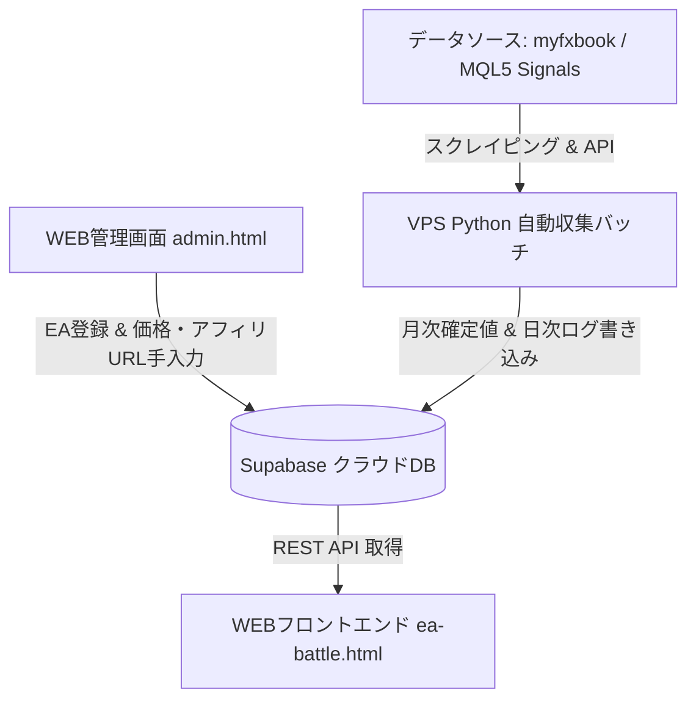

# Dark Venus Lab - EAバトル＆月次パフォーマンス分析システム 仕様書
**ドキュメントバージョン:** v3.0.0  
**最終更新日:** 2026-08-23  
**ステータス:** 確定 (MQL5 Signals ＋ myfxbook ハイブリッド対応版)

---

## 1. システム概要と目的

本システムは、Dark Venus Lab ポータルサイトにおけるキラーコンテンツとして、各種EA（自動売買プログラム）のフォワード成績をトレーディングカード風（TCGスタイル）のリアルタイムランキングカードとして視覚化し、月次パフォーマンス比較・比較検討・アフィリエイトマネタイズを一元管理する自動化システムである。

---

## 2. 全体アーキテクチャ

本システムは以下の3層構造で動作する。



1. **データ収集層 (お名前.com VPS)**:
   * Pythonスクレイパー / APIクライアントが定期実行（月1回 確定データ、日次 ログデータ）。
   * `myfxbook API` および `MQL5 Signals (HTML/JSパース)` から全自動で成績データを取得。
2. **データベース層 (Supabase Cloud DB)**:
   * `eas`: EAマスター情報（価格、アフィリエイトURL、データソース種別など）
   * `ea_monthly_summaries`: 月次確定パフォーマンスログ
   * `ea_daily_snapshots`: 日次残高・有効証拠金・ドローダウン安全監視ログ
3. **管理・表示層 (WEBフロントエンド)**:
   * `admin.html`: EA追加・価格更新・アフィリエイトリンク管理用ダッシュボード
   * `ea-battle.html`: 月次タブ切り替え・TCG風ランキングカード表示画面

---

## 3. 指標・データ分類定義（共通言語規格）

本システムにおける全ての成績データは、役割に応じて以下の2つの共通カテゴリに分類管理される。

### ①『カード評価指標』 (コア6軸指標)
カードの総合レアリティランク（SSS / SS / S / A / B）および各パラメータ（★1〜★5）を全自動計算するために使用する最重要の6指標。

| 指標名 | 単位 / 形式 | 取得データソース / 取得方法 | 備考 |
| :--- | :--- | :--- | :--- |
| **1. 攻撃力** | 月間収益率 (%) | MQL5 `table.years[].months` / myfxbook | 当月度・指定月度の確定成長率 |
| **2. 防御力** | 最大DD (%) | MQL5 `Equity Drawdown %` / myfxbook | 真の最大含み損率 |
| **3. 収益性** | プロフィットファクター (PF) | MQL5 `Profit Factor` / myfxbook | 総利益 ÷ 総損失 |
| **4. 資金効率** | リカバリーファクター (RF) | MQL5 `Recovery Factor` / myfxbook | 累積純利益 ÷ 最大ドローダウン額 |
| **5. 信頼性** | 運用期間 (週数) | MQL5 `Weeks` / myfxbook | 累積運用週数 |
| **6. 手頃感** | 推奨初期資金 (円/ドル) | **WEB管理画面から手入力** | 開発者公式推奨証拠金額 |

---

### ②『その他評価指標』 (詳細スタッツ)
カードの裏面・詳細モーダル表示、およびユーザーの深掘り比較分析用データ。

*   **収益額 (全期間純利益 / USD・円)**
*   **入金総額 (Total Deposits / USD・円)**
*   **出金総額 (Total Withdrawals / USD・円)**
*   **現在残高 (Balance) / 有効証拠金 (Equity)**
*   **勝率 (%) ＆ 勝ち / 負けトレード数**
*   **総取引数 (Trades)**
*   **1週間あたりの平均取引数 (Trades / Week)** ※トレード頻度の評価
*   **平均保有時間 (Average Holding Time)**
*   **シャープレシオ (Sharpe Ratio)**
*   **運用開始日 (Start Date)**

---

## 4. データ収集・パース仕様 (MQL5 Signals)

MQL5 Signals ページ (`https://www.mql5.com/ja/signals/<ID>`) からの自動データ抽出ロジック仕様：

1. **基本ヘッダー抽出**:
   * HTML内 `s-header__title` または `<h1>` よりEA名・シグナル名を取得。
2. **埋め込みJSオブジェクトパース (`table.years`)**:
   * HTML内の `<script>` タグに含まれる `table:{years:[{year:YYYY, months:{...}}]}` JSON構造を正規表現で抽出し、過去全月の月別成長率（%）を完璧に再現。
3. **統計パラメータ抽出**:
   * `プロフィットファクター`, `リカバリーファクター`, `エクイティによる比較ドローダウン (%)`, `信頼性 (週数)`, `1週間当たりの取引`, `平均保有時間`, `入金額`, `出金額` を精確に正規表現パターンマッチング。

---

## 5. データベース構成 (Supabase SQL)

### `eas` (EAマスターテーブル)
```sql
CREATE TABLE eas (
    id SERIAL PRIMARY KEY,
    ea_key VARCHAR(50) UNIQUE NOT NULL,
    name VARCHAR(100) NOT NULL,
    data_source VARCHAR(20) DEFAULT 'mql5', -- 'mql5' または 'myfxbook'
    source_url TEXT NOT NULL,
    currency_pair VARCHAR(20) NOT NULL,
    timeframe VARCHAR(10) NOT NULL,
    logic_type VARCHAR(50),
    broker VARCHAR(50),
    rec_deposit_usd NUMERIC(10, 2) DEFAULT 500.00, -- 手入力の推奨初期資金
    price_text VARCHAR(50) DEFAULT '無料 (オープンソース)',
    price_value NUMERIC(10, 2) DEFAULT 0.00,
    affiliate_url TEXT,
    is_active BOOLEAN DEFAULT true,
    created_at TIMESTAMP WITH TIME ZONE DEFAULT CURRENT_TIMESTAMP
);
```

---

## 6. 改訂履歴 (Version History)

*   **v1.0.0 (2026-08-01)**: 初版。myfxbook APIを前提とした6軸スコアモデルとSQLite DB構成。
*   **v2.0.0 (2026-08-02)**: SupabaseクラウドDB移行、WEB管理画面 `admin.html` 仕様の策定。
*   **v3.0.0 (2026-08-23)**:
    *   **MQL5 Signals全自動スクレイピング対応**（HTML/JSパースによる月別確定利回りの抽出確立）。
    *   **用語統一**: `『カード評価指標』` (6軸) と `『その他評価指標』` (詳細スタッツ) への再定義。
    *   **指標追加**: 入金総額、出金総額、全期間収益額、1週間あたりの平均取引数を正式追加。
    *   **推奨資金運用変更**: 初期入金額のスクレイピング依存を廃止し、開発者推奨額の「手入力運用」を決定。
